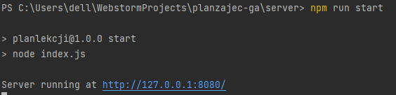
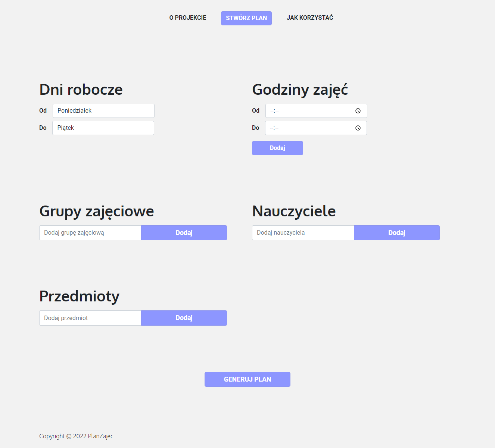
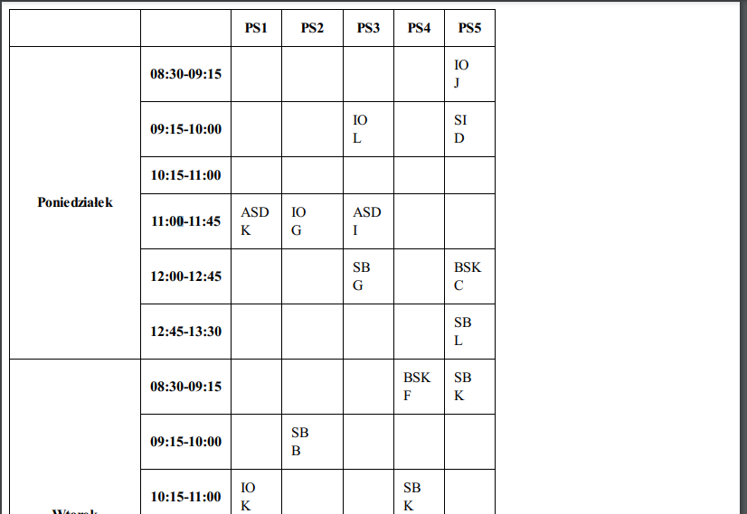

# planzajecga
Schedule generator based on genetical algorithm using NodeJS+React

### Used libraries:
- Genetic Algorithm: https://www.npmjs.com/package/geneticalgorithm/v/1.0.2
- Express: https://expressjs.com – a minimal and flexible Node.js web application framework
- React: https://pl.reactjs.org – JavaScript library for creating user interfaces
- Html-pdf: https://www.npmjs.com/package/html-pdf/v/3.0.1 - used to change
  pages in html to a pdf file
- Ejs: https://www.npmjs.com/package/ejs - used for templates, embedding
  JavaScript in the html code

### Requirements:
- Node.js environment 
(https://nodejs.org/en/)

<br/>

## How it works?

### Configuration
This section does not need any changes for local installation on the computer.
```javascript
// Config
const port = process.env.PORT || 8080;
const hostname = "127.0.0.1";
const debug = true;
```

Options:
- port – value of the PORT environment variable, if set, or your own selected port
- hostname – used hostname
- debug – debug mode, the console displays additional information about incoming requests

### Launch and access to the application
First install project dependencies (run for both /*client* and /*server* folder):
```
npm install
```

To build react application (first navigate to /*client* folder):
```
npm run build
```

To start web server (first navigate to /*server* folder):
```
npm run start
```



Then we can go to the address of our server in the web browser:


In the create a plan tab, we can enter data about the lesson plan to be generated.


After the form is approved, the control is taken over by the backend server, which after the operation is completed
will show the client the timetable in the form of a PDF file.


### Genetical algorithm
The PlanZajecGA class, which uses a library, performs the function of the genetic algorithm
geneticalalgorithm. The library required the creation of its own functions of mutation, crossing,
adaptation and determination of the initial population and its size.

#### Chromosome
The phenotype of each individual consists of: day, class time, subject, class group and
teacher's.
```javascript
generatePhenotype() {
  let phenotype = {
    day: pickRandom(this.data.days),
    time: pickRandom(this.data.times),
    subject: pickRandom(this.data.subjects),
    group: pickRandom(this.data.groups),
    teacher: pickRandom(this.data.teachers)
  };
  return phenotype;
}
```
#### Fitness function
It determines how well an individual is adapted to the environment. A number was taken into account in this function
collisions and the number of surrounding possible gaps in the distribution. The higher the fitness value, the more the individual
it is better adapted.
```javascript
fitness(phenotype) {
  let fitness = 0;
  // use phenotype and possibly some other information
  // to determine the fitness number. Higher is better, lower is worse.
  const pop = this.population;
    // czy przed i po elemencie nastepuja zajecia (+)
  const times = this.data.times;
  const time = phenotype.time;
  const index = times.indexOf(time);
  const day = phenotype.day;
  const group = phenotype.group;
    //godzina-1, godzina+1
  const neighbours = pop.filter(
          comparedElement =>
                  comparedElement.group === group
                  && comparedElement.day === day
                  && Math.abs(index-times.indexOf(comparedElement.time)) === 1
  );
  if(neighbours === undefined)
    fitness -= 2;
  else if(neighbours.length > 2)
    fitness += 2/neighbours.length;
  else
    fitness += neighbours.length;
    // czy wystepuja kolizje (-)
  const collisions = pop.filter(
          comparedElement =>
                  comparedElement.group === group
                  && comparedElement.day === day
                  && index === times.indexOf(comparedElement.time)
  );
  if(collisions === undefined)
    fitness += 2;
  else
    fitness -= collisions.length-1;
  return fitness;
}
```

#### Mutation
The chance of a chromosome mutation is 30%. Then the phenotype of the individual is modified.
```javascript
mutation(oldPhenotype) {
  let resultPhenotype = cloneJSON(oldPhenotype);
    // use oldPhenotype and some random
    // function to make a change to your
    // phenotype
  if(chanceOf(0.3)) {
    resultPhenotype = {
      day: pickRandom(this.data.days),
      time: pickRandom(this.data.times),
      teacher: pickRandom(this.data.teachers),
      subject: pickRandom(this.data.subjects),
      group: pickRandom(this.data.groups)
    }
  }
  return resultPhenotype;
}
```

#### Crossover
The two species may be crossed with a much greater chance. Two individuals exchange
features: class time, subject and group.
```javascript
crossover(phenotypeA, phenotypeB) {
  let result1 = cloneJSON(phenotypeA), result2 = cloneJSON(phenotypeB);
  // use phenotypeA and B to create phenotype result 1 and 2
  if(chanceOf(0.9)) {
    result1 = {
      day: phenotypeA.day,
      time: phenotypeB.time,
      teacher: phenotypeA.teacher,
      subject: phenotypeB.subject,
      group: phenotypeB.group
    };
    result2 = {
      day: phenotypeB.day,
      time: phenotypeA.time,
      teacher: phenotypeB.teacher,
      subject: phenotypeA.subject,
      group: phenotypeA.group
    };
  }
  return [result1, result2];
}
```